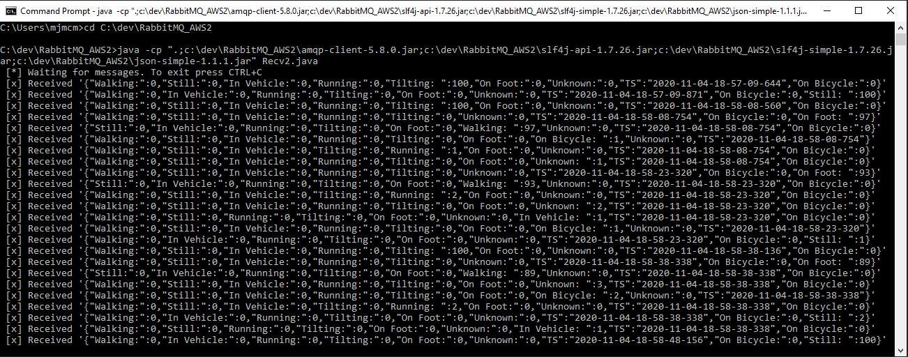

# BCI_MQ_ACTIVITY_v1.0.3
[](https://doi.org/10.5281/zenodo.7892262)

An Mobile Prototype for the generation of activity labelled motor cortex EEG datasets during unconstrained movement in Natural Settings based on the OpenBCI Cortxa board.  

Android 
- The minSdkVersion for this App is set to level 26 (Android Version 8.0.0 - Oreo) and the targetSdkVersion level 29. 

IDE
- We used Android Studio 4.1 as IDE but IntelliJ should also work fine since one is based on the other

The main files are
- AndroidManifest.xml (Configs)
- MainActivity (Starting point and control of the app)
- BciService (This class configures and manages the connection to the OpenBCI Cytron Board)
- BciSender (This class contains sender thread to send commands to the OpenBCI Cyton Board)
- BciReceiver (This class groups methods for receiving data from the OpenBCI Board)
- OpenBci (Worker class that convert incoming EEG and accelerometer data into standard 32-bit signed integers)
- ActivityRecognizedService (Gets the Phone Activity Recognition data and send it to the Cloud Message Broker) 
- RabbitmqConnection: (Manages the connection details to the AWS RabbitMQ Broker)

Libs
- d2xx.jar (FTDI Driver to communicate with the OpenBCI Dongle)
- json-simple-1.1.1.jar (simple Java toolkit to encode or decode JSON text)
- amqp-client-5.8.0.jar (RabbitMQ Java client)
- slf4j-api-1.7.26.jar and slf4j-simple-1.7.26.jar (Simple Logging Facade for Java)

RabbitMQ_Receiver_JSON Folder
- You will need to download this folder to your local system and build the receiver files with your RabbitMQ connection details - see commands.txt for details

HowTo
- HowTo Step-by-Step doc. 

# How to set up & run BCI MQ Activity Android App v1.0.2

* [Setup RabbitMQ Broker on AWS](#setup-rabbitmq-broker-on-aws)

	* [Register with Amazon Web Services (AWS)](#register-with-amazon-web-services-aws)

	* [Generate an AWS Key Pair](#generate-an-aws-key-pair)

	* [Create an AWS Security Group](#create-an-aws-security-group)

	* [Deploy RabbitMQ on An AWS Cloud Server](#deploy-rabbitmq-on-an-aws-cloud-server)

	* [Log in to RabbitMQ Console](#log-in-to-rabbitmq-console)

* [Create a RabbitMQ RECEIVE clients](#create-a-rabbitmq-receive-clients)

* [Install Android Studio](#install-android-studio)

* [Setup Android Bridge Debug (ABD)](#setup-android-bridge-debug-abd)

* [Download and Run the Source Code](#download-and-run-the-source-code)

* [Connect and Setup the OpenBCI Dongle](#connect-and-setup-the-openbci-dongle)

* [How to use the App](#how-to-use-the-app)

* [License](#license)

* [Contact](#contact)

* [References](#references)

Setup RabbitMQ Broker on AWS
============================

**Here are the steps you'll need to follow in order to setup and AWS EC2 RabbitMQ Broker**:

Register with Amazon Web Services (AWS)

Generate an AWS key pair

Create an AWS security group

Deploy RabbitMQ on an AWS cloud server

Log in to RabbitMQ

The next sections will walk you through these steps in detail.

Register with Amazon Web Services (AWS)
---------------------------------------

You will need an Amazon account to log in and sign up. If you already
have an Amazon Web Services account obviously just skip this step.

To create it, follow these steps:

Browse to http://aws.amazon.com and click the "Create an AWS account"
button at the top of the page. In the resulting page, enter an email
address, a password, and an AWS account name. Then, click "Continue" to
start the registration process.


Once you've signed into Amazon, sign up for AWS by selecting the account
type and providing some basic contact information and your mobile phone
number.


Once that's done, proceed to the next stage by entering your credit card
information. Click the "Secure Submit" button to continue with the
account creation.


**NOTE:** When you first sign up for AWS, you get automatic access to
the AWS Free Tier, which entitles you to 12 months of free usage up to
certain limits. This includes 750 hours per month of free usage of
Amazon EC2 micro servers, which are ideal for our Proof of
Concept/Minimum Viable Product needs.

Amazon will now verify your identity, by making an automated call to
your mobile phone number and prompting you to enter the PIN number
displayed on the screen. Once your identity is verified, choose the
"Basic" support plan (also free) and confirm your account. You will then
be redirected to a welcome page, which includes a link to the AWS
management console.

Generate an AWS Key Pair
------------------------

You will have generated an SSH key pair to access your EC2 instances. If
you already have an SSH key pair for the AWS region you are operating
in, skip this step. To generate an SSH key pair, which you will need to
log in to your EC2 instances, follow the steps below:

Log in to the AWS Console and from the Amazon Web Services menu, select
the EC2 service.


Make sure you switch to the region where your instance will be launched
using the region selector in the top right corner

From the Amazon EC2 dashboard, select the "Key Pairs" option in the
"Network & Security" menu.

Click the "Create Key Pair" button. In the resulting dialog box, enter a
name for the new key pair and click the "Create" button.


A new key pair, consisting of an SSH public and private key, will be
generated. You will be prompted to download the private SSH key to your
computer.

**NOTE:** You will only be able to download the private SSH key once.
Store it safely as you will not be able to log in to your AWS servers
without it.

Create an AWS Security Group
----------------------------

You will need to create an AWS security group for your cloud server. By
default, AWS cloud servers have their ports closed to secure them
against external attacks. Since RabbitMQ is a Web application, it is
necessary to open to the following incoming ports:

22: for ssh connections

5672: used by AMQP 0--9--1 and 1.0 clients without and with TLS

15672: HTTP API clients and rabbitmqadmin (Management Web GUI

25672: used by Erlang distribution for inter-node and CLI tools
communication and is allocated from a dynamic range (limited to a single
port by default, computed as AMQP port + 20000).

From the Amazon Web Services menu, select the EC2 service.


From the Amazon EC2 dashboard, select the "Security Groups" option in
the "Network & Security" menu and click the "Create Security Group"
button.


In the resulting dialog box, enter a name and description for the for
the new security group.

Click the "Add Rule" button and add new rules 22 for SSH, 5672 for
RabbitMQ, 15672 for HTTP - Management Web GUI, 25672 for Health Check
using the following guidelines:


For Source: Use "Anywhere" to allow access from anywhere, or use "Custom
IP" and specify an IP address range.

Click the "Create" button to save your changes.

Deploy RabbitMQ on An AWS Cloud Server
--------------------------------------

The next step is to launch a cloud server with the Bitnami RabbitMQ
Amazon Machine Image (AMI) running on it. The AWS Console lets you do
this in just a couple of clicks.

From the Amazon Web Services menu, select the EC2 service.


From the Amazon EC2 dashboard, select the "AMIs" option in the "Images"
menu


Search for the Bitnami RabbitMQ AMI by selecting "Public Images" and
entering the search term "bitnami RabbitMQ" in the search bar at the
top.

Although RabbitMQ is tested with most major Linux distributions, Ubuntu
support for Amazon EC2 seems to be strongest, so that\'s the
distribution we will use. For my own testing I used
bitnami-rabbitmq-3.8.2-0-linux-debian-9-x86_64-hvm-ebs-nami.

Select the image in the list of search results and click the "Launch"
button.


On the next screen, you will have to choose the instance type based on
the load RabbitMQ is expected to handle. A "micro" server will work fine
for a low-traffic. Then click Next: Configure details in the bottom.


On the review page, click the "Edit security groups" link.


On the "Configure Security Group" page, choose the option to "Select an
existing security group". Find the security group you created earlier
and select it. Click the "Review and Launch" button to proceed.


Verify that the correct key pair (created earlier) will be used for the
server.


Confirm your selection by hitting the "Launch Instances" button and the
AWS Console will now begin spinning up the new server.


The process usually takes a few minutes, and you can use the EC2
Dashboard to check the status of the server. Once the server has
launched, you will be able to obtain its public IP address and public
DNS name from the EC2 Dashboard.

Log in to RabbitMQ Console
--------------------------

To get the administrator username and password, follow these steps:

-   In the left navigation bar, select the "Instances -\> Instances"
    menu item.

-   Select your instance.

-   From the "Actions" drop-down menu, select the "Get System Log" menu
    item.


Review the system log until you find a message with the application
username and password.


**NOTE: This password is only shown the first time you start the image.
Please save it in a safe place.**

However, you can also obtain the username and password at any time by
checking the bitnami_credentials file as detailed here:
<https://docs.bitnami.com/aws/faq/get-started/find-credentials/#option-2-find-credentials-by-connecting-to-your-application-through-ssh>

At this point, you should be able to browse to the RabbitMQ Management
Console, by entering the cloud server IP address or DNS name directly
into your browser's address bar. You should now see your login page as
shown below. You can use

**admin:** admin as username

**password:** from the launch configuration log above.


You should now be able to see your RabbitMQ Console


Create a RabbitMQ RECEIVE clients
=================================

Create the two RECEIVE clients -- one for EEG data and the second for
ACTIVITY data - which will create QUEUE and wait for messages which It
is expecting to receive as a JSON string. Two example files are bundled
with the project in the RabbitMQ_Receiver_JSON folder. You will need to
add some configuration information specific to your own setup.
```
//We need to import some classes
import org.json.simple.JSONObject;
import org.json.simple.parser.JSONParser;

import com.rabbitmq.client.Channel;
import com.rabbitmq.client.Connection;
import com.rabbitmq.client.ConnectionFactory;
import com.rabbitmq.client.DeliverCallback;

//Set up the class and name the queue
public class Recv 
{
    private final static String QUEUE_NAME = "YOUR QUEUE NAME"; //Set your queue name

//then we can create a connection to the server
    public static void main(String[] argv) throws Exception {
        ConnectionFactory factory = new ConnectionFactory();
        factory.setHost("YOUR AWS EC2 IP ADDRESS"); //Set your AWS EC2 IP Address
        factory.setUsername("YOUR AWS EC2 RABBITMQ USERNAME"); //Set your RabbitMQ Username
        factory.setPassword("YOUR AWS EC2 RABBITMQ PASSWORD"); //Set your RabbitMQ Password
        factory.setVirtualHost("/");
        factory.setPort(5672);
        Connection connection = factory.newConnection();

//we open a channel, and declare the queue from which we're going to consume        
	Channel channel = connection.createChannel();
        channel.queueDeclare(QUEUE_NAME, false, false, false, null);
        System.out.println(" [*] Waiting for messages. To exit press CTRL+C");

//tell server to deliver messages from queue async and provide callback to buffer messages 
        DeliverCallback deliverCallback = (consumerTag, delivery) -> {
            String message = new String(delivery.getBody(), "UTF-8");
            System.out.println(" [x] Received '" + message + "'");
        };
        channel.basicConsume(QUEUE_NAME, true, deliverCallback, consumerTag -> { });
    }
}

```
You will need to use the following Libraries when building which are
included in the RabbitMQ_Receiver_JSON Folder

-   amqp-client-5.8.0.jar

-   slf4j-simple-1.7.26.jar

-   json-simple-1.1.1.jar

TO BUILD:
Navigate to the folder containing your RECEIVER java files and the above Libs – then run:

\>javac -cp \".;\<YOUR LOCAL
LOCATION\>\\amqp-client-5.8.0.jar;c:\\dev\\RabbitMQ_AWS2\\json-simple-1.1.1.jar\"
Recv.java

\>javac -cp \".;\<YOUR LOCAL
LOCATION\>\\amqp-client-5.8.0.jar;c:\\dev\\RabbitMQ_AWS2\\json-simple-1.1.1.jar\"
Recv2.java

TO RUN:

\>java -cp \".;\<YOUR LOCAL LOCATION\>\\amqp-client-5.8.0.jar;\<YOUR
LOCAL LOCATION\>\\slf4j-api-1.7.26.jar;\<YOUR LOCAL
LOCATION\>\\slf4j-simple-1.7.26.jar;\<YOUR LOCAL
LOCATION\>\\json-simple-1.1.1.jar\" Recv.java

\>java -cp \".;\<YOUR LOCAL LOCATION\>\\amqp-client-5.8.0.jar;\<YOUR
LOCAL LOCATION\>\\slf4j-api-1.7.26.jar;\<YOUR LOCAL
LOCATION\>\\slf4j-simple-1.7.26.jar;\<YOUR LOCAL
LOCATION\>\\json-simple-1.1.1.jar\" Recv2.java


Install Android Studio 
======================

Download Android Studio for here: <https://developer.android.com/studio>
- We have used version 4.0.1 for development of this project but latest
should work fine.

Once downloaded open the IDE


Setup Android Bridge Debug (ABD)
================================

The inbuilt Android emulator is unfortunately not very helpful for
debugging the BCI application as we need to test using a real-time EEG
signal. We need to be able plug in the OpenBCI dongle via OTG into an
Android phone to test and debug over an Android Debug Bridge (ADB)
connection.

Android Debug Bridge (adb) is a command-line tool that lets you
communicate with a device for installing and debugging apps, and it
provides access to a Unix shell that you can use to run a variety of
commands on a device. It is a client-server program that includes three
components: A CLI client on your development machine, a daemon (adbd)
which runs commands on a device and a server which manages communication
between the client and the daemon.

abd is included in the Android SDK Platform-Tools package - download
this package with the SDK Manager, which installs it
at android_sdk/platform-tools/ -
<https://developer.android.com/studio/intro/update#sdk-manager>

Before you can start debugging on your device you need to open the
Settings app on your phone, select Developer options, and then enable
USB debugging.

**NOTE:** On Android 4.2 and higher, the Developer options screen is
hidden by default. To make it visible, go to *Settings \> About phone*
and tap Build number seven times. Return to the previous screen to find
Developer options at the bottom.

**NOTE:** When you connect a device running Android 4.2.2 or higher, the
system shows a dialog asking whether to accept an RSA key that allows
debugging through this computer. This security mechanism protects user
devices because it ensures that USB debugging and other adb commands
cannot be executed unless you\'re able to unlock the device and
acknowledge the dialog.

Connect your device to the development machine using USB

Open Command Prompt and navigate to: *CD C:\\Users\\YOUR
USERNAME\\AppData\\Local\\Android\\Sdk\\platform-tools*

Type \'adb devices\' and this will show a list of devices attached to
the development machine

Set the target device to listen for a TCP/IP connection on port number
5555 using command \'adb tcpip 5555\' and wait for this step to
complete. (Make sure the port number selected is not already in use)

Disconnect the USB cable from the target device.

Find the IP address of the Android device. For example, on a Nexus
device, you can find the IP address at Settings \> About tablet (or
About phone) \> Status \> IP address.

Connect to the device by its IP address \'adb connect *IP address* \'

Confirm that your host computer is connected to the target device by
typing \'adb devices\'


If the adb connection is ever lost make sure that your host is still
connected to the same Wi-Fi network your Android device is on and
reconnect by executing the adb connect step again or if that doesn\'t
work, reset your adb host using: \'adb kill-server\'. Then start over
from the beginning.

Download and Run the Source Code
================================

Download Source Code from GitHub here:
<https://github.com/michaelmcmahon/BCI_MQ_ACTIVITY_v1.0.0> and open the
project in Android Studio IDE


The main files are

-   AndroidManifest.xml (Configs)

-   MainActivity (Starting point and control of the app)

-   BciService (This class configures and manages the connection to the
    OpenBCI Cyton Board)

-   BciSender (This class contains sender thread to send commands to the
    OpenBCI Cyton Board)

-   BciReceiver (This class groups methods for receiving data from the
    OpenBCI Board)

-   OpenBci (Worker class that convert incoming EEG and accelerometer
    data into standard 32-bit signed integers)

-   ActivityRecognizedService (Gets the Phone Activity Recognition data
    and send it to the Cloud Message Broker)

-   RabbitmqConnection: (Manages the connection details to the AWS
    RabbitMQ Broker)

Libs

-   d2xx.jar (FTDI Driver to communicate with the OpenBCI Dongle)

-   json-simple-1.1.1.jar (simple Java toolkit to encode or decode JSON
    text)

-   amqp-client-5.8.0.jar (RabbitMQ Java client)

-   slf4j-api-1.7.26.jar and slf4j-simple-1.7.26.jar (Simple Logging
    Facade for Java)

RabbitMQ_Receiver_JSON Folder

-   You will need to download this folder to your local system and build
    the receiver files with your RabbitMQ connection details - see
    commands.txt for details

In order to connect to your RabbitMQ broker you will need to add you IP
Address, Username and Password to the RabbitmqConnection.


Make sure your Android Debug Bridge (adb) is setup as per the
instructions in Section 4 and you can connect to you Android Mobile
Device.


You now need to ensure you have selected your device from the Devices
List dropdown in Android Studio.


You should now be able to build and run the App and it will setup on
your phone ready for use.

Connect and Setup the OpenBCI Dongle
====================================

Firstly, you will need to connect the OpenBCI Dongle to an OTG cable


Connect the Dongle to your mobile device and you should see a blue LED
light up and stay on. When you first attach the Dongle you will get a
pop-up on the Android Device asking if you want to allow the connection
and if you want to associate that device with the App. **NOTE:** Make sure 
your USB Dongle is switched to GPIO 6 and not RESET


Next you will need to turn on your OpenBCI Board by moving the small
switch on the right side of the board from \"OFF\" to \"PC\". As soon as
you do, you should see a blue LED turn on. If you don\'t, press the
reset (RST) button just to the left of the switch. If the LED still does
not turn on, make sure you have full battery.


You should see a single red flash on the dongle as the OpenBCI Board and Dongle handshake and both are now connected.


How to use the App
==================

Open the App on you Android Mobile Devices and you should see the below
screen.


**TEST SIGNAL:** The Test Signal checkbox turns on all the available
channels and connects them to an internal test signal. This feature is
very useful for self-test and calibration. 

x(CHANNEL, POWER_DOWN, GAIN_SET, INPUT_TYPE_SET, BIAS_SET, SRB2_SET, SRB1_SET)X

x1065110X
x2065110X
x3065110X
x4065110X
x5065110X
x6065110X
x7065110X
x8065110X

For normal usage with incoming OpenBCI EEG signals just leave this box
unchecked

**START/STOP:** The Start/Stop button just does what it says on the tin
-- sends start and stop commands to the OpenBCI Board **NOTE:** when you
hit stop you will continue to receive EEG signal data for a short amount
of time as the OpenBCI board will stop streaming data however the App
buffer will continue to hold data and will finish delivery of this data
until empty.

**RESET:** Send \'v\' to send a soft reset for the Board peripherals

When you click the “Start Streaming” button in the app the board will start 
the EEG data streams from the Board to the App continuously once started until 
you click "Stop Streaming" and you should see the RXD red light flickering as 
data is transmitted.


The App will start streaming both EEG and Activity Data to the two RabbitMQ 
receivers you setup earlier

EEG DATA STREAM


ACTIVITY DATA STREAM



EXAMPLE SETUP FOR EXPERIMENT


(a) IDUN Dryode Electrodes (b) OpenBCI Dongle connected via the OTG cable and Mobile Ap-plication interface (c)The Electrode Cap Liner aligns and holds the electrodes on the scalp (c) The Electrode Beanie with a pocket for the OpenBCI board (e) Front view of the unobtrusive Electrode Beanie.

License
==================

Distributed under the MIT License. See 'LICENSE' for more information.

Contact
==================

m.mcmahon15 @ nuigalway.ie

References
==================

1. ActivityRecognitionClient - Android
https://developers.google.com/android/reference/com/google/android/gms/location/ActivityRecognitionClient

2. ABD - Android
https://developer.android.com/studio/command-line/adb.html#wireless

3. Bitnami AWS RabbitMQ
https://bitnami.com/stack/rabbitmq/cloud/aws/amis

4. Braindroid - Florian Friemel
https://github.com/florian-f/braindroid/blob/master/src/main/java/org/florian/eeg/braindroid/OpenBci.java

5. Create your own AWS RabbitMQ Cluster, the dubizzle way - Ibrahim AbdelFattah
https://tech.olx.com/create-your-own-aws-rabbitmq-cluster-the-dubizzle-way-b4c632cb47d6

6. Cyton Board SDK - OpenBCI
https://docs.openbci.com/docs/02Cyton/CytonSDK

7. FTDI
https://www.ftdichip.com/Support/SoftwareExamples/Android_Projects.htm

8. JSON messages with RabbitMQ - Pas Apicella 
http://theblasfrompas.blogspot.com/2013/02/json-messages-with-rabbitmq.html

9. OpenBCI_Processing - Joel Murphy and Conor Russomanno
https://github.com/openbci-archive/-DEPRECATED-OpenBCI_Processing/blob/master/OpenBCI_GUI/OpenBCI_ADS1299.pde

10. How to recognize user activity with activity recognition - Paul Trebilcox-Ruiz
https://code.tutsplus.com/tutorials/how-to-recognize-user-activity-with-activity-recognition--cms-25851

11. RabbitMQ Android Chat - Karthikeyan NG
https://github.com/intrepidkarthi/RabbitMQ-Android-Chat
