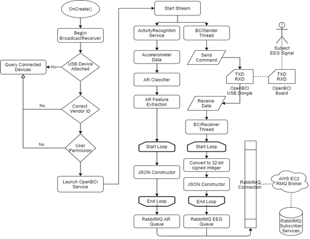

# Summary
In recent years, the application of Machine Learning to signal processing and classification of Electroencephalography (EEG) Brain Computer Interfaces (BCI) has greatly assisted in the identification of Event Related Potentials associated with a subjects’ specific cognitive, physical, or sensory behaviour (@roy2019deep)(@smalley2019business). These methods require large amounts of consistent, and activity labelled, EEG datasets to train the algorithm and then to test the resulting models accuracy (@hosseini2020review)(@al2021deep). Early-stage Researchers, and PhD students in particular, can be constrained by the expense of generating these labelled EEG datasets due to the cost of the research grade equipment, the extensive per subject application time required, and the complexity of capturing associated time synchronised labelling metadata. Our Android Mobile App, which utilizes the low cost OpenBCI board and the Android Activity API, for the generation of physical activity labelled EEG datasets, is designed to help address this issue for researchers who are focused on Motor Cortex investigations \autoref{fig:1}.

# Statement of need
This Java based Android Mobile App was created from our own experience as researchers in the area of Brain Computer Interfaces and the difficulty, and expense, we encountered in generating large amounts of consistent, labelled, EEG datasets to train and test Machine Learning models to identify Event Related Potentials associated with the Motor Cortex. in this specific area of BCI, researchers will often need to record and synchronise additional sensor data such as full-body motion capture or goniometer systems in constrained environments such laboratories or gyms (@cho2017eeg)(@kaya2018large)(@he2018mobile)(@brantley2018full). To address this issue, we have created the open-source App to acquire a subject’s Activity labelled Motor Cortex EEG signals, during unconstrained movement in everyday environments, over longer periods of time. The App connects wirelessly to an OpenBCI board, and the EEG data is linked through the app with the Activity API sensor data in the phone for time synchronised labelling, and then transmitted to a Rabbit MQ server in the cloud via 4G to generate consistent, activity labelled, EEG datasets in real-time that can be made available to any connected subscriber systems \autoref{fig:2}. 

Although our reference implementation of the system is configured to focus on Motor Cortex EEG, and a subject's physical activity for labelling, the software could be modified to focus on other regions of the Cerebral Cortex and utilize any of the available APIs in the Android system for labelling - For example, looking at photos and the occipital lobe, making phone calls and Broca's area, listening to music and the auditory cortex etc. \autoref{fig:3}. We are currently using the App to generate datasets in our research which we plan to publish in the near future.

# Related Projects
Since we started development on the Android App, OpenBCI itself has moved to assist in integrating its hardware with projects in multiple programming languages through the introduction of Brainflow Project which provides a uniform data acquisition API however the Cyton OpenBCI board is still not a supported on Android within this project as yet due the use of the Nordic Gazelle stack and library for the RFduino radio link between board and dongle (@brainflow) which was one of the main technical challenges we faced. The Brainflow Project does provide support for OpenBCI Cyton on Windows, Linux, MacOS and Devices like Raspberry Pi. 

# Acknowledgements
The authors declare that they have no competing financial, non-financial or institutional interests that could have appeared to influence the work reported in this paper.

# References
